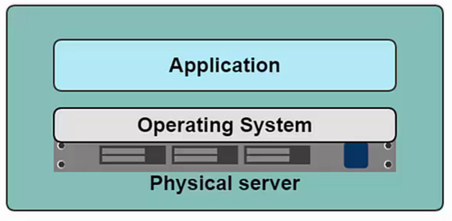
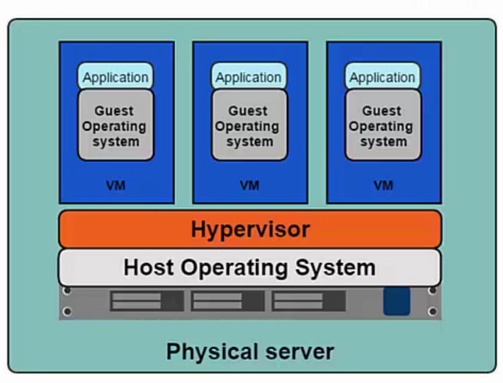
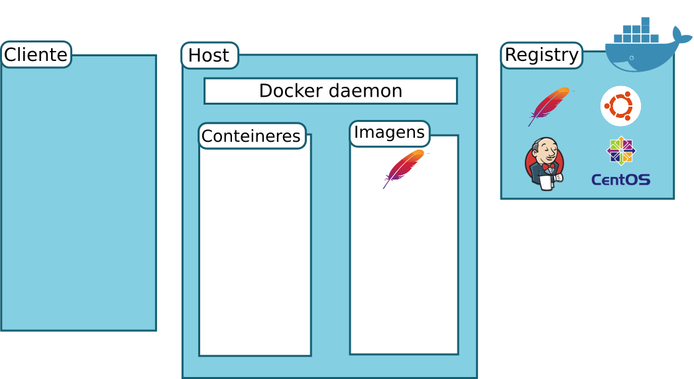
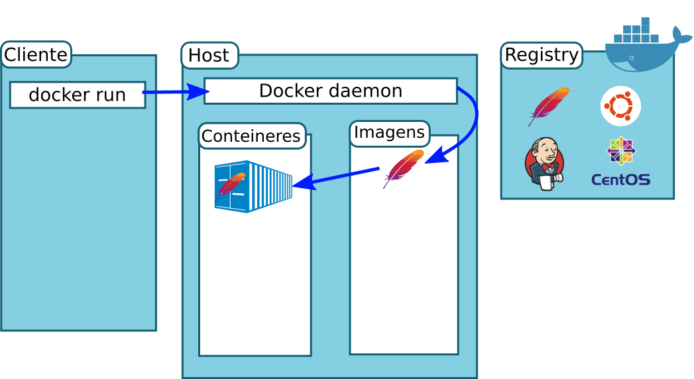
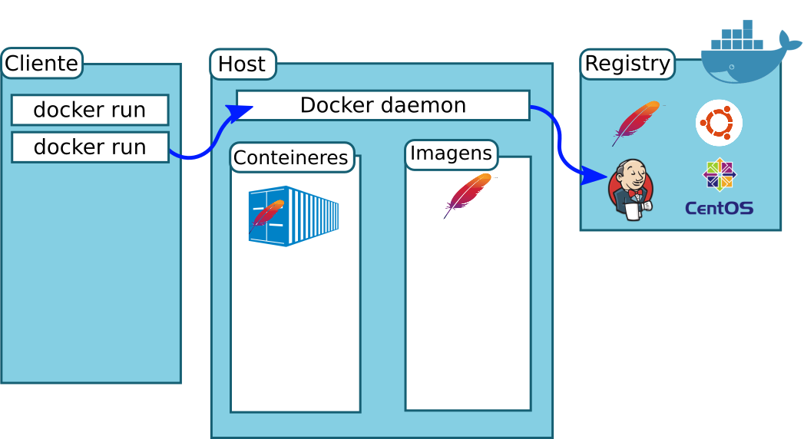
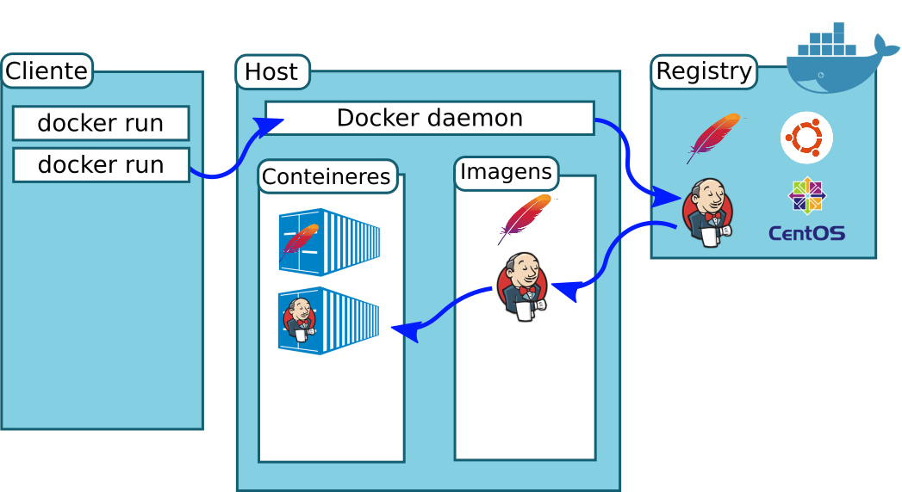

#  <!-- .element: width="250" height="250" style="border:none; background:none; box-shadow:none"--> Docker +  <!-- .element: width="200" height="200" style="border:none; background:none; box-shadow:none"--> Kubernetes

--

## O Poder dos contêineres na Infraestrutura
### Marcelo Linhares e Fábio Nitto

--------------------------------------------

DTI/MP

---

## Quem somos?

---

## Motivação

---

## O que é Contêiner?

Área isolada de processamento com separação entre processos.

- Implementado com LXC (Linux Containers) - 2008  
  - Virtualização a nível de SO.

--

- Funcionalidades de virtualização no Kernel do linux:
  - Namespaces <!-- .element: class="fragment" data-fragment-index="3" -->
  - Cgroups <!-- .element: class="fragment" data-fragment-index="4" -->
  - Capabilities <!-- .element: class="fragment" data-fragment-index="5" -->
  - APParmor e SELinux <!-- .element: class="fragment" data-fragment-index="6" -->
  - Seccomp Policies <!-- .element: class="fragment" data-fragment-index="7" -->
  - Chroots <!-- .element: class="fragment" data-fragment-index="8" -->

Note: 
Namespaces - isolamento de PID(processo), mounts, rede, ipc(ex. fifos, semaforos, memoria compartilhada), UTS (hostnames e domainname), Usuarios

cgroups - isolamento de recursos - CPU, memoria, disco, rede

APParmor e SELinux - Controle de acesso a escrita e modificação de arquivos, principalmente /proc

Capabilities: Controle sobre as capacidades do usuario root (UID 0), ex. 

Seccomp - Controle sobre chamadas de sistema 

chroot - altera o diretorio root do sistema/conteiner

---
## Porque contêineres?

## Máquina Física
 <!-- .element: align="left" width="500" style="border:none; background:none; box-shadow:none" class="fragment" data-fragment-index="0" -->

- Deployment lento		<!-- .element: class="fragment" data-fragment-index="1" -->
- Alto custo			<!-- .element: class="fragment" data-fragment-index="2" -->
- Desperdicio de recursos	<!-- .element: class="fragment" data-fragment-index="3" -->
- Dificuldade de escalar	<!-- .element: class="fragment" data-fragment-index="4" -->
- Dificuldade de migração	<!-- .element: class="fragment" data-fragment-index="5" -->
- Vendor Lock-in		<!-- .element: class="fragment" data-fragment-index="6" -->

--
## Hypervisor
 <!-- .element: align="left" width="450" style="border:none; background:none; box-shadow:none" class="fragment" data-fragment-index="0" --> 

- Pool de recursos		<!-- .element: class="fragment" data-fragment-index="1" -->
- Maior facilidade de escala	<!-- .element: class="fragment" data-fragment-index="2" -->
- VMs na nuvem			<!-- .element: class="fragment" data-fragment-index="3" -->
  - Elasticidade		<!-- .element: class="fragment" data-fragment-index="3" -->
  - Pay as you go		<!-- .element: class="fragment" data-fragment-index="3" -->

- Alocação de recursos   
  ainda necessária		<!-- .element: class="fragment" data-fragment-index="4" -->
- OS guest necessário				<!-- .element: class="fragment" data-fragment-index="5" -->
  - recursos desperdiçados			<!-- .element: class="fragment" data-fragment-index="5" -->
- Portabilidade não garantida			<!-- .element: class="fragment" data-fragment-index="6" -->

--
## Contêineres
 <!-- .element: align="left" width="400" style="border:none; background:none; box-shadow:none" class="fragment" data-fragment-index="0" --> 

- Mais leves (tamanho)			<!-- .element: class="fragment" data-fragment-index="1" -->
- Sem OS guest necessário		<!-- .element: class="fragment" data-fragment-index="2" -->
- Menos recursos necessarios 
  (CPU,RAM,Storage) 			<!-- .element: class="fragment" data-fragment-index="3" -->
  - Mais containers por host		<!-- .element: class="fragment" data-fragment-index="3" -->
- Maior portabilidade			<!-- .element: class="fragment" data-fragment-index="4" -->	

Note: Maior portabilidade pois abstrai a rede, filesystem e outros recursos.
---

## VM's vs Contêineres

---

# Docker

--

## Componentes docker
 <!-- .slide: data-transition="fade-out" -->
--
## Docker run
 <!-- .slide: data-transition="fade" -->
--
## Docker run
 <!-- .slide: data-transition="fade" -->
--
## Docker run
 <!-- .slide: data-transition="fade" -->
--
## Docker run
 <!-- .slide: data-transition="fade" -->
--
## Docker pull 
 <!-- .slide: data-transition="fade" -->
--
## Docker pull
 <!-- .slide: data-transition="fade" -->
--
## Docker build
 <!-- .slide: data-transition="fade" -->
--

Demo

---

# Provisionamento

---

# Docker-compose

--

Demo

---

# Orquestração

## Por que cluster e orquestração?

- Alta disponibilidade
- Resiliência
- Escalabilidade automática
- Deploy e rollback imediato e sem indisponibilidade

---

# Kubernetes

--

Demo

---

# Obrigado!
