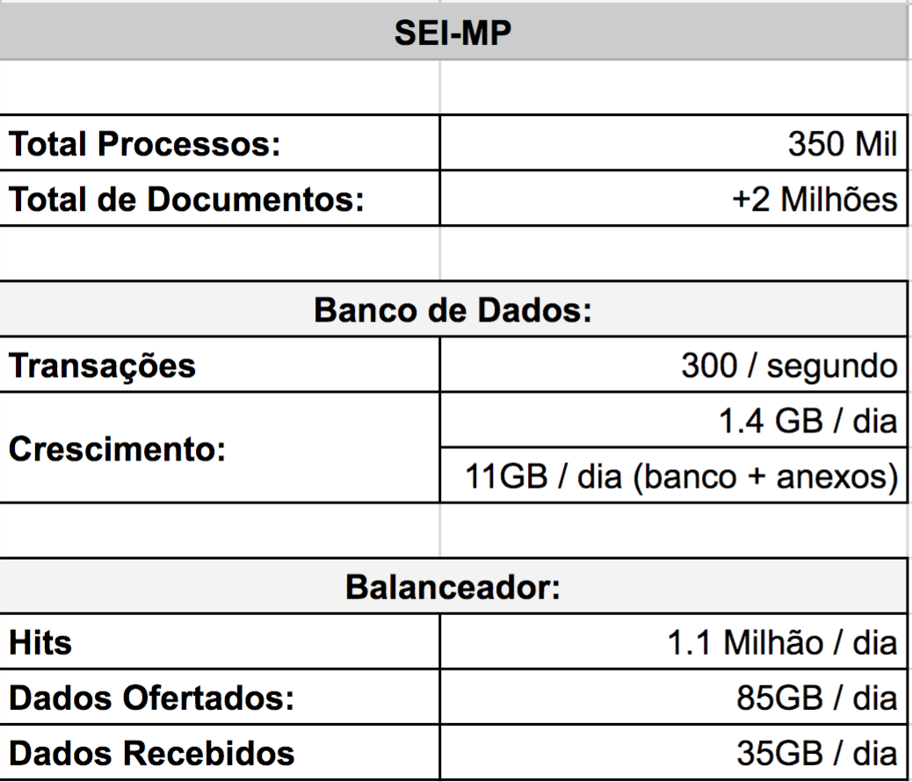
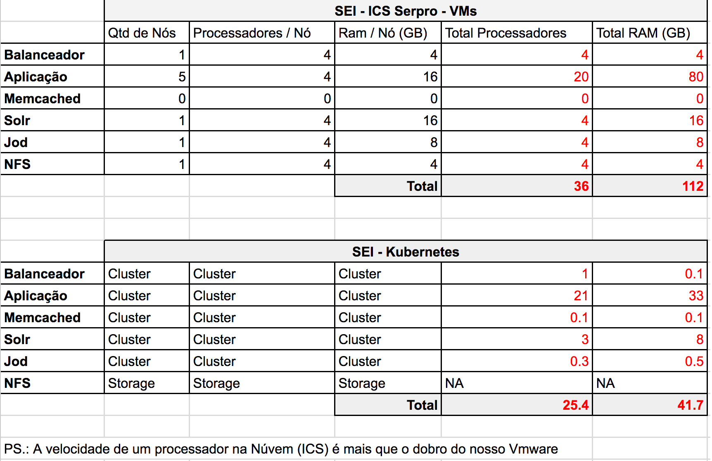
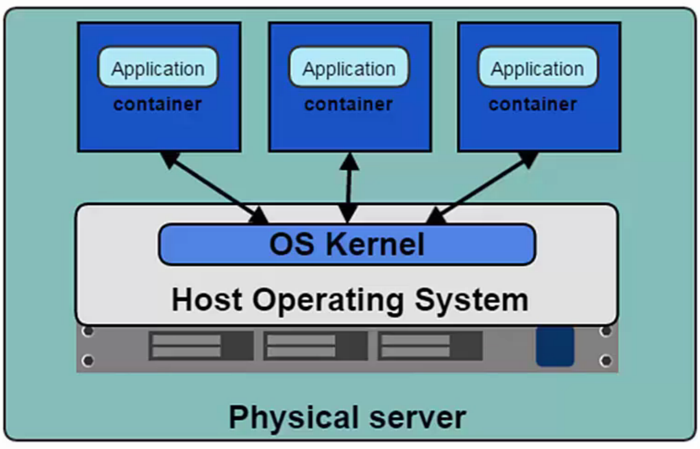
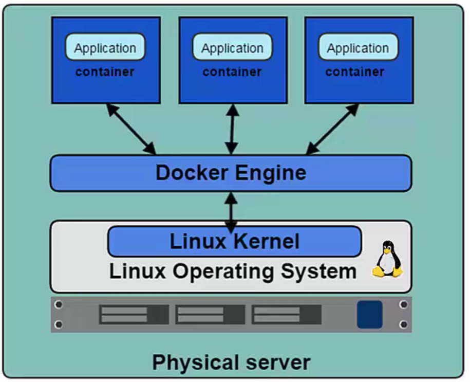
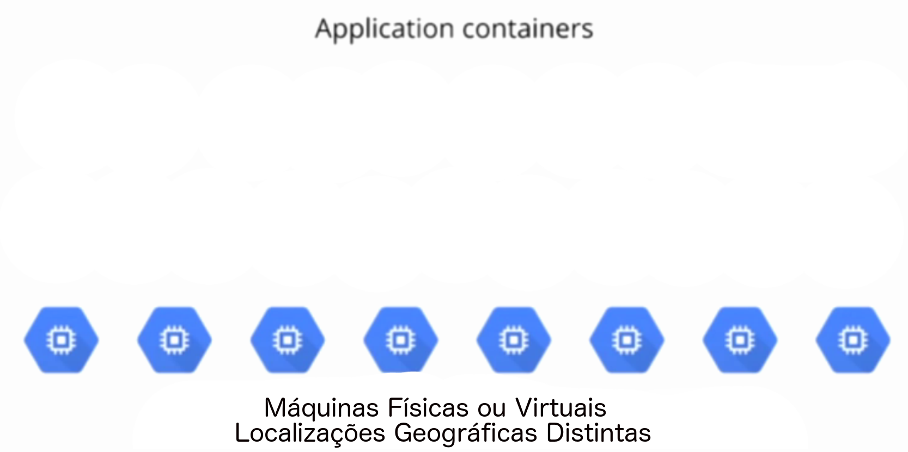

 <!-- .element: height="200" align="left" style="border:none; background:none; box-shadow:none"--> 
 <!-- .element: height="150" align="right" style="border:none; background:none; box-shadow:none"-->
# Docker + 
## Kubernetes 

--

## O Poder dos contêineres na Infraestrutura
### Marcelo Linhares e Fábio Nitto

--------------------------------------------

DTI/MP
---

## Quem somos?

---

## Motivação

 
 

#### Implantação / Sustentação de Sistemas <!-- .element: class="fragment" data-fragment-index="1" -->

---

### Dificuldades encontradas <!-- .slide: data-transition="fade" -->

- Diversidade de fontes externas fornecendo sistemas <!-- .element: class="fragment" data-fragment-index="1" -->
    - fábrica <!-- .element: class="fragment" data-fragment-index="2" -->
    - desenvolvimento interno <!-- .element: class="fragment" data-fragment-index="3" -->
    - demais áreas <!-- .element: class="fragment" data-fragment-index="4" -->
    - fábricas contratadas pelas áreas <!-- .element: class="fragment" data-fragment-index="5" -->

--

### Dificuldades encontradas <!-- .slide: data-transition="none" -->

- Ausência de Documentação (Implant/Sust) <!-- .element: class="fragment" data-fragment-index="1" -->
- Ausência de Padrões <!-- .element: class="fragment" data-fragment-index="2" -->
- Ausência de Configurações Apropriadas <!-- .element: class="fragment" data-fragment-index="3" -->
- Custo de sustentação (recursos humanos) <!-- .element: class="fragment" data-fragment-index="4" -->
- Alto risco ao migrar <!-- .element: class="fragment" data-fragment-index="5" -->

---

### Conteinerização / Orquestração
 

- Borg - Google <!-- .element: class="fragment" data-fragment-index="1" -->
- gmail, maps, search, docs, etc <!-- .element: class="fragment" data-fragment-index="1" -->
- de Borg para Kubernetes <!-- .element: class="fragment" data-fragment-index="2" -->

---

### Como está no MP

- começamos a estudar em 02/2016 <!-- .element: class="fragment" data-fragment-index="2" -->
- fase experimental (em produção) <!-- .element: class="fragment" data-fragment-index="3" -->
- AFD - Assentamento Funcional Digital <!-- .element: class="fragment" data-fragment-index="4" -->
- SEI - Sistema Eletrônico de Informações (desde 18/07) <!-- .element: class="fragment" data-fragment-index="5" -->
- Rancher - Nuvem <!-- .element: class="fragment" data-fragment-index="6" -->

---

#  <!-- .element: width="80%" height="80%" style="border:none; background:none; box-shadow:none"-->

---

 <!-- .slide: data-transition="fade-out" -->

---

 <!-- .slide: data-transition="fade-out" -->

---
## O que é Contêiner?

Área isolada de processamento com separação entre processos.

- Implementado com LXC (Linux Containers) - 2008  
- Virtualização a nível de SO.

--

- Funcionalidades de virtualização no Kernel do linux:
  - Namespaces <!-- .element: class="fragment" data-fragment-index="3" -->
  - Cgroups <!-- .element: class="fragment" data-fragment-index="4" -->
  - Capabilities <!-- .element: class="fragment" data-fragment-index="5" -->
  - APParmor e SELinux <!-- .element: class="fragment" data-fragment-index="6" -->
  - Seccomp Policies <!-- .element: class="fragment" data-fragment-index="7" -->
  - Chroots <!-- .element: class="fragment" data-fragment-index="8" -->

Note: 
Namespaces - isolamento de PID(processo), mounts, rede, ipc(ex. fifos, semaforos, memoria compartilhada), UTS (hostnames e domainname), Usuarios

cgroups - isolamento de recursos - CPU, memoria, disco, rede

APParmor e SELinux - Controle de acesso a escrita e modificação de arquivos, principalmente /proc

Capabilities: Controle sobre as capacidades do usuario root (UID 0), ex. 

Seccomp - Controle sobre chamadas de sistema 

chroot - altera o diretorio root do sistema/conteiner

---
## Porque contêineres?

--

## Máquina Física
 <!-- .element: align="left" width="500" style="border:none; background:none; box-shadow:none" class="fragment" data-fragment-index="0" -->

- Deployment lento		<!-- .element: class="fragment" data-fragment-index="1" -->
- Alto custo			<!-- .element: class="fragment" data-fragment-index="2" -->
- Desperdicio de recursos	<!-- .element: class="fragment" data-fragment-index="3" -->
- Dificuldade de escalar	<!-- .element: class="fragment" data-fragment-index="4" -->
- Dificuldade de migração	<!-- .element: class="fragment" data-fragment-index="5" -->
<!-- - Vendor Lock-in -->

--
## Hypervisor
 <!-- .element: align="left" width="450" style="border:none; background:none; box-shadow:none" class="fragment" data-fragment-index="0" --> 

- Pool de recursos		<!-- .element: class="fragment" data-fragment-index="1" -->
- Maior facilidade de escala	<!-- .element: class="fragment" data-fragment-index="2" -->
- VMs na nuvem			<!-- .element: class="fragment" data-fragment-index="3" -->
  - Elasticidade		<!-- .element: class="fragment" data-fragment-index="3" -->
  - Pay as you go		<!-- .element: class="fragment" data-fragment-index="3" -->
- Alocação de recursos   
  ainda necessária		<!-- .element: class="fragment" data-fragment-index="4" -->
- OS guest necessário				<!-- .element: class="fragment" data-fragment-index="5" -->
  - recursos desperdiçados			<!-- .element: class="fragment" data-fragment-index="5" -->
- Portabilidade não garantida			<!-- .element: class="fragment" data-fragment-index="6" -->

--
## Contêineres
 <!-- .element: align="left" width="400" style="border:none; background:none; box-shadow:none" class="fragment" data-fragment-index="0" --> 

- Mais leves (tamanho)			<!-- .element: class="fragment" data-fragment-index="1" -->
- Sem OS guest necessário		<!-- .element: class="fragment" data-fragment-index="2" -->
- Menos recursos necessarios 
  (CPU,RAM,Storage) 			<!-- .element: class="fragment" data-fragment-index="3" -->
  - Mais containers por host		<!-- .element: class="fragment" data-fragment-index="3" -->
- Maior portabilidade			<!-- .element: class="fragment" data-fragment-index="4" -->	

Note: Maior portabilidade pois abstrai a rede, filesystem e outros recursos.

---

## Docker Engine

 <!-- .element: align="left" width="400" style="border:none; background:none; box-shadow:none" class="fragment" data-fragment-index="0" --> 

- Docker Client	<!-- .element: class="fragment" data-fragment-index="1" -->
- Docker Daemon <!-- .element: class="fragment" data-fragment-index="1" -->
- Contêineres	<!-- .element: class="fragment" data-fragment-index="1" -->
- Imagens	<!-- .element: class="fragment" data-fragment-index="1" -->
- Registry	<!-- .element: class="fragment" data-fragment-index="1" -->

Note: Afinal o que é docker?
      Utilizar o LXC direto é complexo.
      Docker criou uma interface amigável para criar, executar e gerenciar containers.
      Meio de campo entre usuario e kernel
--

## Componentes docker
 <!-- .slide: data-transition="fade-out" -->
--
## Docker run
 <!-- .slide: data-transition="fade" -->
--
## Docker run
 <!-- .slide: data-transition="fade" -->
--
## Docker run
 <!-- .slide: data-transition="fade" -->
--
## Docker run
 <!-- .slide: data-transition="fade" -->
--
## Docker pull 
 <!-- .slide: data-transition="fade" -->
--
## Docker pull
 <!-- .slide: data-transition="fade" -->
--
## Docker build
 <!-- .slide: data-transition="fade" -->
--

Demo

---

## Docker Compose

Note: Exemplo SEI: versão 1 da api.
	Docker compose já está na versão 2 da API, contemplando volumes e networks.
---

## Provisionamento

--

Demo

---

## Orquestração

--

## Por que cluster e orquestração?

- Docker compose em apenas um host
- Alta disponibilidade
- Resiliência
- Escalabilidade automática
- Deploy e rollback imediato e sem indisponibilidade

--

## Opções

- Kubernetes
- Docker Swarm
- Apache Mesos
- Nomad

---

## Kubernetes
=======
 <!-- .slide: data-transition="fade-out" -->

---

 <!-- .slide: data-transition="fade-out" -->

---

 <!-- .slide: data-transition="fade-out" -->

---

Demo

---

# Obrigado!

> **fabio.nitto**@planejamento.gov.br
> **marcelo.linhares**@planejamento.gov.br
